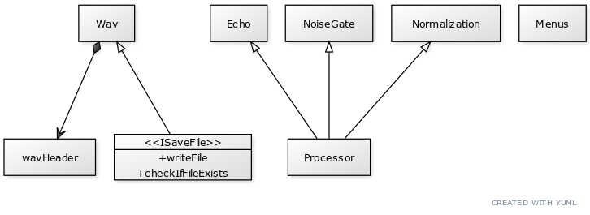

# CS 202 Semester Project Template

## Group Members
- Richard Cao
- Chad Josim
- Zachary Poole

## Responsibilites
- Richard Cao: User Interaction, File I/O
- Chad Josim: File I/O, Documentation Page
- Zachary Poole: Wav Processing, File I/O

## Design

The Wav functions serve to read and write specific data from the given audio files. The User Interface allows the user to choose which processor to run, designation of processed audio file, and whether or not they want to export a CSV file. The Echo, Noise Gate, and Normalization classes serve to execute separate processor functionalities.

## Challenges
In general, most of the challenges we encountered during this project were related to the File I/O, especially reading data from wav files. Figuring out how to alter the code depending on the type of audio file (8/16/24/32 bit and mono/stereo) was definitely the hardest part of the assignment. A smaller problem we encountered was configuring our own portions of code without full knowledge of how each individual piece would be established in the project as a whole.

